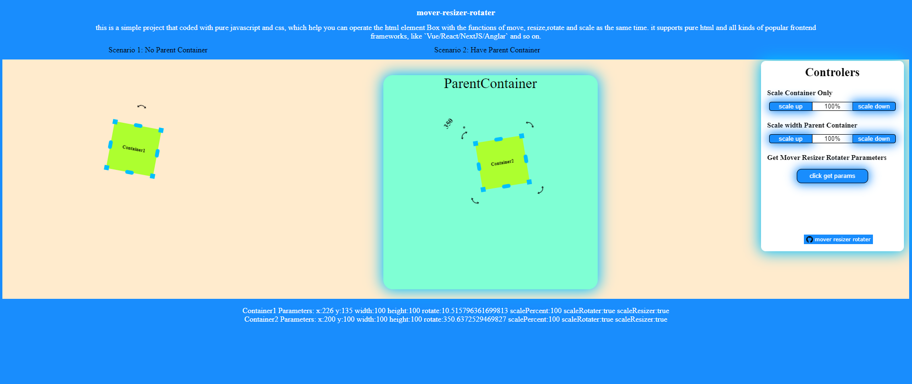

# mover-resizer-rotater
this is a simple project that coded with pure javascript and css, which help you can operate the html element Box with the functions of move, resize,rotate and scale as the same time. it supports pure html and all kinds of popular frontend frameworks, like `Vue/React/NextJS/Anglar` and so on.
you can try it online, just clicked here: <a href="https://bertramye.github.io/mover-resizer-rotater">mover-resizer-rotater</a>  

<a href="https://bertramye.github.io/mover-resizer-rotater">
<!--  -->

</a>

# 1. How to use it
## A. parameters before installation && importing

### <span id='available_initial_paramaters'> before  install or import are are some of avalaible parameters to use </span>:
|    parameters     | available_values_type         | descriptions |
|  --------------   | ----------------------------- | ------------ |
|     x             |   number                      | the target label's x coordinate , this value come from the <a href="https://developer.mozilla.org/en-US/docs/Web/CSS/transform-function/translateX">translateX</a> function |
|     y             |   number                      | the target label's y coordinate , this value come from the <a href="https://developer.mozilla.org/en-US/docs/Web/CSS/transform-function/translateY">translateY</a> function
|   rect            |    null                       | the target label's Rect, which comes from the <a href="https://developer.mozilla.org/en-US/docs/Web/API/Element/getBoundingClientRect" > getBoundingClientRect </a> function
|   width           |   number                      | the target label's width, if target label already have it, no need to set
|   height          |   number                      | the target label's height ,  if target label already have it, no need to set
|   rotate          |   number                      | label's rotate degrees,come from the <a href="https://developer.mozilla.org/en-US/docs/Web/CSS/transform-function/rotateZ" >rotateZ</a> function, if you don't want to give a initial values, no need to set            
| <span id='scalePercent'>scalePercent</span>      |   number                      | default scaled the target label percent, default is 100, which means the 100%, which come from the <a href="https://developer.mozilla.org/en-US/docs/Web/CSS/transform-function/scale">scale</a> function
| moverAvailable    |    bool                       | if you want the target label can be moved or not, `true`: the target label can't be moved, `false` or not set the parameters means the target label can not be moved 
| rotaterAvailable  | array[string,string,....]     | which directions rotater can be created or show, and this parameters must be included here: `['nw', 'n', 'ne', 'e', 'se', 's', 'sw', 'w']`, for example, the `n` means `north` rotater will be created and show, and also if you don't want any rotater, you needn't set this `rotaterAvailable` paramaters or just keep it empty array.
| resizerAvailable  | array[string,string,....]     | which directions resizer can be created or show, and this parameters must be included here: `['nw', 'n', 'ne', 'e', 'se', 's', 'sw', 'w']`, for example, the `n` means `north` resizer will be created and show, and also if you don't want any rotater, you needn't set this `resizerAvailable` paramaters or just keep it empty array.       
| scaleRotater      |    bool                       | wheather keep all the rotater scale size no change,when you call the api `SetMoveResizeRotateParameters` to reset the target label `scalePercent`,default is true,it means the target label scaled, the Rotater will scaled as the same time
| scaleResizer      |    bool                       | wheather keep all the scaleResizer scale size no change,default is false, when you call the api `SetMoveResizeRotateParameters` to reset the target label `scalePercent`,default is true, it means the target label scaled, the Rotater will scaled as the same time  
| rotatersIconPath    | string                      | sometimes you need change the rotater icons' style , so you can set this option to change all rotater's icons' style, default icon path is `icons/default-rotater-icon.svg`


## B. installation && import

### here are below provide two kinds of ways to use this lib, here below:
#### a. use in the pure html
download the latest version <a href="https://github.com/BertramYe/mover-resizer-rotater/releases">packge</a>, unzip the packge, and copy all of the content of the packge and put them in your projects
```html
.....
<head>
    .....
    <!-- import these two lib files -->
    <link rel="stylesheet" href="./mover-resizer-rotater/index.css">
    <script src="./mover-resizer-rotater/index.js"></script>
</head>
<body>
    <!-- target label -->
    <div id="targetContainer"></div>
    <!-- initial and use this functions -->
    <script>
        ..... 
        let objectLabel_id = "targetContainer"
        let initial_paramaters =  {
            moverAvailable:true,                                                // target label can be moved
            rotaterAvailable:['n'],                                             // target label's rotater
            resizerAvailable:['nw', 'n', 'ne', 'e', 'se', 's', 'sw', 'w'],      // target label's resizer
        }

        // initial target label
        let objectLabel = initTargetContainerMoveRoateResize(objectLabel_id,initial_paramaters)
        .....
    </script>
</body>
</html>
.....

```
#### b. use with the npm (recommend)
1) install with npm
```bash
npm i mover-resizer-rotater --save
```

2) use it in your project
```js
// import initial functions
import { 
    initTargetContainerMoveRoateResize,
    ScaledTargetContainerWithParentLabel,
    GetMoveResizeRotateParameters,
    SetMoveResizeRotateParameters
    } 
from 'mover-resizer-rotater';

// import css styles
import "mover-resizer-rotater/index.css"

let objectLabel_id = "targetContainer"
let initial_paramaters =  {
        moverAvailable:true,                                                // target label can be moved
        rotaterAvailable:['n'],                                             // target label's rotater
        resizerAvailable:['nw', 'n', 'ne', 'e', 'se', 's', 'sw', 'w'],      // target label's resizer
    }

// initialed target label
let objectLabel = initTargetContainerMoveRoateResize(objectLabel_id,initial_paramaters) 


// for the other apis below, you can also import like below:
import { GetMoveResizeRotateParameters,SetMoveResizeRotateParameters, ScaledTargetContainerWithParentLabel } from 'mover-resizer-rotater';

......


```

3) addition for the `TypeScript` projects
> if your projects use the `TypeScript` , to use current lib, please create a new declare files named `mover-resizer-rotater.d.ts`, and put it in your projects' root path and then inpput the codes here below, otherwise , there will be an error occured when building.
```jsx
// mover-resizer-rotater.d.ts
// decalre for supporting the `TypeScript`
declare module 'mover-resizer-rotater' {
    export function initTargetContainerMoveRoateResize(elementID:string,params: object): HTMLElement;
    export function ScaledTargetContainerWithParentLabel(element:HTMLElement | null,scaledPercent: number): void;
    export function SetMoveResizeRotateParameters(element:HTMLElement | null,params: object): void;
    export function GetMoveResizeRotateParameters(elementID:HTMLElement | null): object;
}
```

# 2. Available APIs
## A. <span id='initTargetContainerMoveRoateResize'>  initTargetContainerMoveRoateResize </span>
> this api is to use to initial the target the labels, to call it you can input two parameters here below:


| paramaters          | type        |               descriptions                 |
| ------------------  | ----------  | ------------------------------------------ | 
| label's ID          | string      | the target label's ID, which is `required` |
| initial_parametsers | object,{}   | to initial target label's parameters, which is `optional`, and here are all of the options you can  [reference](#available_initial_paramaters) |
 
> when you call the api above ,it will return the initialed label, with it, you can continite to call the apis below

## B. GetMoveResizeRotateParameters
> this api is to use to get the target label'paramters after you initialed the target label with the api[`initTargetContainerMoveRoateResize`](#initTargetContainerMoveRoateResize), and moved, resized, rotated or scaled the target label , to call it you can input a parameter here below:

| paramaters          | type        |               descriptions                 |
| ------------------  | ----------  | ------------------------------------------ | 
| label               | object      | the target label,you can get it from the [`initTargetContainerMoveRoateResize`](#initTargetContainerMoveRoateResize) api, which is `required`      |

> after you call this api, you can all of the values here below, which come from the intial's settings, you can [reference](#available_initial_paramaters):
```js
// `objectLabel` come from the api of initTargetContainerMoveRoateResize
let get_parameters = GetMoveResizeRotateParameters(objectLabel)
console.log(get_parameters)

// then you can ge the print value like below:
// noted, the "..." stands for value's details
{
    x: ...,
    y: ...,
    rect: {...},
    width: ...,
    height: ...,
    rotate: ...,
    scalePercent: ...,
    scaleRotater: ...,
    scaleResizer: ...,
}
``` 
## C. SetMoveResizeRotateParameters
> this api is to use to set the target label'paramters after you initialed the target label with the api  [`initTargetContainerMoveRoateResize`](#initTargetContainerMoveRoateResize), during moved, resized, rotated or scaled the target label , to call it you can input two parameters here below:

| paramaters          | type        |               descriptions                 |
| ------------------  | ----------  | ------------------------------------------ | 
| objectLabel         | object      | the target label,you can get it from the [`initTargetContainerMoveRoateResize`](#initTargetContainerMoveRoateResize) api, which is `required`      |
| new_parametsers     | object,{}   | to initial target label's parameters, which is `required`, and here are all of the options are available to reset, you can click here to [reference](#available_initial_paramaters) |

> by the way, here a api call example:

```js

.....
// create a new parameters
let new_paramaters = {
    with: 20,              // set the target container with as 20 px
    moverAvailable:false,  // remove the function of moving target label,
    resizerAvailable:['nw', 'ne', 'se','sw'], // only  this four resizers available here: 'nw', 'ne', 'se','sw'
    rotaterAvailable:[], // remove all of the rotater from the target label
}

// then you can set the parameters with the api below
// `objectLabel` come from the api of initTargetContainerMoveRoateResize
SetMoveResizeRotateParameters(objectLabel,new_paramaters)
......

```
## D. ScaledTargetContainerWithParentLabel
> additionally，sometimes, you may need scale the target label with it's parent dom node, in this case, you can use this api below.
> and by the way, to use it, here are two paramaters you need to offer

| paramaters          | type        |               descriptions                 |
| ------------------  | ----------  | ------------------------------------------ | 
| objectLabel         | object      | the target label,you can get it from the [`initTargetContainerMoveRoateResize`](#initTargetContainerMoveRoateResize) api, which is `required`      |
| neededScaledPercent | number      | this values means need to scaled parcent, and it must be the numbers, like your oringinal [`scalePercent`](#scalePercent) is `100` and then you set this value as 30, and when you run this api, you can get the scaled label with 70% scaled, this value can be `+/-`, but the final scaled value can't less than 0 |

> by the way, here a api call example:

```js

// surpose the `neededScaledPercent` is 30 ;
let neededScaledPercent = 30
// then you can set the parameters with the api below
// `objectLabel` come from the api of initTargetContainerMoveRoateResize
ScaledTargetContainerWithParentLabel(objectLabel,neededScaledPercent)

```


